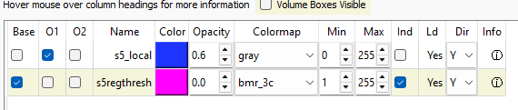

# khartes-exp-2024-10-05
 added autoseg on overlays 

this repository extends khartes by adding auto extension/autoseg to existing segments by following a provided set of binary overlays. it computes a local region of connected components, gets all the pixels, and drives a line through them using interpolation. some bugs , not fully fleshed out. one major bug is tracking cursors cause crashes i have yet to track down. 

due to the fact that it computes connected components on the data window region, if there is a area with a merge, simply zoom in until you do not see the merge. similarly, if you have a region with little connections, you can zoom way out and run very long lengths. keep in mind that khartes parameterization will have difficulty with skinny triangles, so try and maintain a nice uniform rectangle shaped mesh. 

to use it , set the overlay as the base volume and the raw data as the overlay, as in this screenshot. 

i have also modified some keybinds -- 
press (3) to extend left, 
press (4) to extend right, 
press (5) to delete a node, 
press tilde to reparameterize 

fork of @khartes_chuck khartes branch here https://github.com/KhartesViewer/khartes/tree/exp-2024-10-05 

i did not fork it correctly and cant figure out how to fix it.

